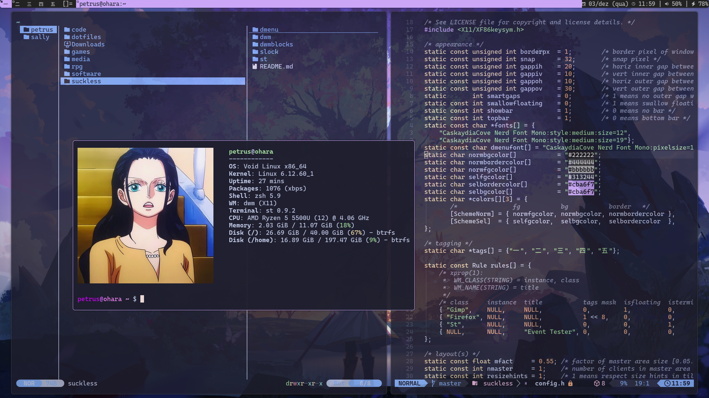

  <h1>dotfiles</h1>
  <h3>Petrus' awesome and super cool dotfiles</h3>

## Preview:

## Details:

| Class | Tool |
------|------
| OS                 |    [Void](https://voidlinux.org/) |
| WM                 |    [dwm](https://dwm.suckless.org/) |
| Terminal           |    [st](https://st.suckless.org/) |
| Shell              |    [Zsh](https://zsh.org/) & [Oh-My-Zsh](https://ohmyz.sh/) |
| Fonts              |    [Nerd Fonts](https://www.nerdfonts.com/) |
| Colorscheme        |    [Catppuccin](https://catppuccin.com/) |
| Launcher           |    [dmenu](https://tools.suckless.org/dmenu/) |
| Compositor         |    [picom](https://github.com/yshui/picom) |
| File Manager       |    [yazi](https://github.com/sxyazi/yazi) |
| Code Editor        |    [Neovim](https://neovim.io/) / [LazyVim](https://www.lazyvim.org/) |
